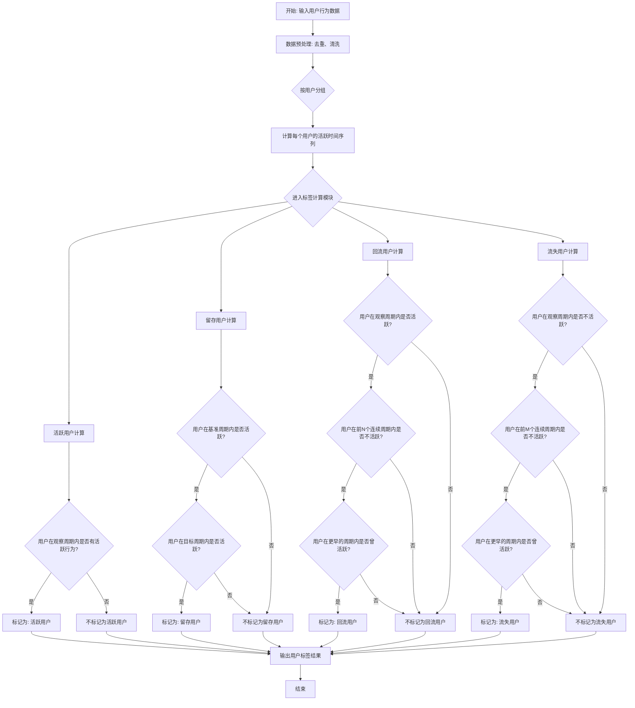

# 用户人群标签计算流程图

## Mermaid语法流程图



## 详细计算逻辑说明

### 1. 数据预处理阶段
- **输入数据**：用户ID、行为时间戳、行为类型
- **数据清洗**：
  - 去除重复记录
  - 处理缺失值
  - 标准化时间格式
- **关键操作**：将行为时间按观察周期（日/周/月）进行分组

### 2. 活跃时间序列构建
- 为每个用户构建活跃时间序列，记录用户在每个时间周期是否活跃
- 活跃定义：在时间周期内有至少一次指定的活跃行为
- 输出：用户ID × 时间周期的活跃状态矩阵

### 3. 标签计算逻辑

#### 3.1 活跃用户计算
```
活跃用户 = 所有在观察周期内有活跃行为的用户
```

#### 3.2 留存用户计算
```
留存用户 = 
    用户集合 where (
        用户在基准周期内活跃 AND 
        用户在目标周期内活跃
    )
```

#### 3.3 回流用户计算
```
回流用户 = 
    用户集合 where (
        用户在观察周期内活跃 AND
        用户在流失观察窗口内（前N个周期）不活跃 AND
        用户在流失观察窗口之前曾有活跃记录
    )
```

#### 3.4 流失用户计算
```
流失用户 = 
    用户集合 where (
        用户在观察周期内不活跃 AND
        用户在连续流失阈值内（前M个周期）不活跃 AND
        用户在连续流失阈值之前曾有活跃记录
    )
```

### 4. 参数说明
| 参数 | 描述 | 默认值 |
|------|------|--------|
| 观察周期 | 计算活跃状态的时间窗口 | 日/周/月 |
| 活跃行为 | 定义用户是否活跃的行为类型 | 登录/核心功能使用 |
| 流失观察窗口 | 判定回流用户的流失时长 | 1-3个周期 |
| 连续流失阈值 | 判定流失用户的连续不活跃时长 | 3-6个周期 |
| 基准周期 | 计算留存的起始时间周期 | 通常为目标周期的前一个周期 |

### 5. 结果输出
- 输出格式：用户ID × 用户标签的矩阵
- 标签类型：活跃用户、留存用户、回流用户、流失用户
- 注意：同一用户可能同时被标记为多种标签（如活跃用户同时也是留存用户）